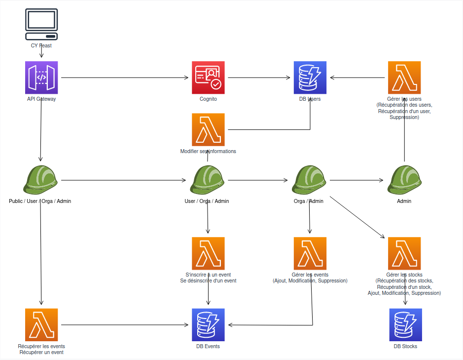

[](https://classroom.github.com/a/fi-kF-yD)
# CY-2023_Perpective2-AWS
## Modéliser et codage d'une une infrastructure Cloud Serverless

## Attendus
### Etape 1
En binôme, modélisez une infrastructure Cloud Serverless AWS correspondant au back-end du projet du module Angular à savoir :
- des rôles public, utilisateur identifié, organisateur d'événements, admin
- un utilisateur peut lister les événements et s'y inscrire
- un organisateur peut gérer les stocks et créer des événements
- un admin hérite des autres fonctions et peut gérer les utilisateurs

Par ailleurs :
- utilisez un système délégué pour gérer les identifications (service tiers)
- stockez les informations des utilisateurs pour connaître leurs nom / prénom et les événéments auxquels ils assistent
- prenez en compte la ségmentation des droits d'accès et les paramètres de sécurité
- prenez en compte les règles de protection des données et la possibilité d'anonymiser ou de supprimer des données personnelles
- vous avez toute lattitude pour les données relatives aux événements et stocks (gérez comme vous voulez)

### Etape 2
Codez l'infrastructure modélisée à l'adie du CDK AWS. Livrez le code sur le dépôt de l'assignement.

Si vous avez des questions, merci de me les communiquer.

## Evaluations
Vous serez évalués sur une infrastructure qui fonctionne. Les différents composants doivent s'interconnecter. Testez votre code sur le Learner Lab, notamment pour les Lambdas pour vérifier qu'il fonctionne et qu'il produit l'infrastructure attendue.
Les accès à l'environnement de déploiement sera limité à des plages spécifiques. Vous ne pourrez les déployer que dans des périodes limitées.

# Élève

Louis FLOREANI ING3 ICC

# Schéma de l'infrastructure aws



# Les routes & requêtes HTTP

/events: GET, POST, DELETE, PUT

/stocks: GET, POST, DELETE, PUT

/users: GET, DELETE

events/{event-id}: GET

stocks/{stock-id}: GET

users/{user-id}: GET

events/sign-up-to-event: POST

events/sign-out-from-event: POST

users/update-user: PUT

# Les bodys

/events: POST ->
```bash
{
    "event-id": "{id}", 
    "name": "{name}",
    "date": "{date}",    
    ...
}
```

/events: DELETE ->
```bash
{
    "event-id": "{id}"
}
```

/events: PUT -> 
```bash
{
    "Key": {
        "event-id": "{id}"
    },
    "UpdateExpression": "set #name = :name, #date = :date",
    "ExpressionAttributeNames": {
        "#name": "name",
        "#date": "date"
    },
    "ExpressionAttributeValues": {
        ":name": "{newName}",
        ":date": "{newDate}"
    }
}
```

...

/events/sign-up-to-event: POST -> 
```bash
{ 
    "eventId": "{id}" 
}
```

/events/sign-out-from-event: POST -> 
```bash
{
    "eventId": "{id}" 
}
```

/users/update-user: PUT ->
```bash
{
    "user-id": "{user-id}",
    "email": "{newEmail}"
}
```

# Accès

/events: GET -> public

/events: POST, DELETE, PUT -> User authentifié, Orga ou Admin

/stocks: GET, POST, DELETE, PUT -> User authentifié, Orga ou Admin

/users: GET, DELETE -> User authentifié, Admin

events/{event-id}: GET -> public

stocks/{stock-id}: GET -> User authentifié, Orga ou Admin

users/{user-id}: GET -> User authentifié, Admin

events/sign-up-to-event: POST -> User authentifié

events/sign-out-from-event: POST -> User authentifié

users/update-user: PUT -> User authentifié, avec le même id que l'user modifié 

(un user ne peut modifier que son propre profil)

# Jeton JWT

La stack créer automatiquement un système d'inscription / login avec l'Hosted UI de Cognito qui permet d'accéder au token jwt de l'user.

Pour cela :

-> CyTechUserPool

-> App Integration

-> CyTechUserPoolClient (en bas de la page)

-> View Hosted UI

-> Dans l'url, remplacer "response_type=code" par "response_type=token", puis Entrée

-> Sign Up

-> Entrer le code de vérification reçu

-> L'id token est disponible dans l'URL, à utiliser dans Postman en tant que Bearer Token

# Orga, Admin

La stack créer automatiquement les groupes Orga et Admin. Pour qu'un user devienne Orga ou Admin, il faut l'ajouter au groupe, puis refresh son token.

Pour cela : 

-> CytechUserPool

-> Groups

-> Choisir le groupe

-> Ajouter l'user

-> Retourner dans l'Hosted UI

-> Changer la réponse de l'url en token

-> Sign In

-> Utiliser le nouveau token


